# q8s-qpu-proxy

## Overview

This project provides the deployment of a QPU proxy service. The QPU proxy service is a service that provides a REST API to interact with a QPU (Quantum Processing Unit) service. The QPU proxy service is a stateless service that forwards requests to the QPU service and returns the response to the client.

## Repository structure

The repository is structured as follows:

- `app`: Contains the source code of the QPU proxy service.
- `manifests`: Contains the Kubernetes deployment files.
- `experiments`: Contains the experiment files used to demonstrate the fucntionality of the QPU proxy service.

## Deployment model

```mermaid
architecture-beta
group q8s(logos:kubernetes)[Cluster]
group q8sns[qubernetes] in q8s
group q8sjobs[jobs] in q8s

service pod(server)[Job] in q8sjobs
service proxysrv(server)[QPU Proxy SRV] in q8sns
service proxyapi(server)[QPU Proxy API] in q8sns
service qpu(internet)[QPU Gateway]

pod:R --> L:proxysrv
proxysrv:R --> L:proxyapi
proxyapi:R --> L:qpu
```

