```mermaid
architecture-beta
group q8s(logos:kubernetes)[Cluster]
group q8sns[qubernetes] in q8s
group q8sjobs[jobs] in q8s

service pod(server)[Job] in q8sjobs
service proxysrv(server)[QPU Proxy SRV] in q8sns
service proxyapi(server)[QPU Proxy API] in q8sns
service qpu(internet)[QPU Gateway]

pod:R --> L:proxysrv
proxysrv:R --> L:proxyapi
proxyapi:R --> L:qpu
```

# q8s-qpu-proxy

## Overview

This project provides the deployment of a QPU proxy service. The QPU proxy service is a service that provides a REST API to interact with a QPU (Quantum Processing Unit) service. The QPU proxy service is a stateless service that forwards requests to the QPU service and returns the response to the client.

## Repository structure

The repository is structured as follows:

- `app`: Contains the source code of the QPU proxy service.
- `manifests`: Contains the Kubernetes deployment files.
- `experiments`: Contains the experiment files used to demonstrate the fucntionality of the QPU proxy service.

## Getting started

### Prerequisites

- Kubernetes cluster
- QPU gateway (IQM)

### Deploy the service

Deploy the service to the cluster using the following command:

```bash
kubectl apply -k manifests/base
```

### Submit quantum jobs

Submit quantum jobs to the QPU proxy service using the following command:

```bash
kubectl apply -f experiments/job.yaml
```

### Execution model

The QPU proxy service is a stateless service that forwards requests to the QPU service and returns the response to the client. The QPU proxy service is a REST API that accepts POST requests with a JSON payload. The JSON payload contains the quantum circuitin qasm format to be executed on the QPU service.



The proxy service takes care of authentication and authorization of the requests to the external QPU Gateway.
